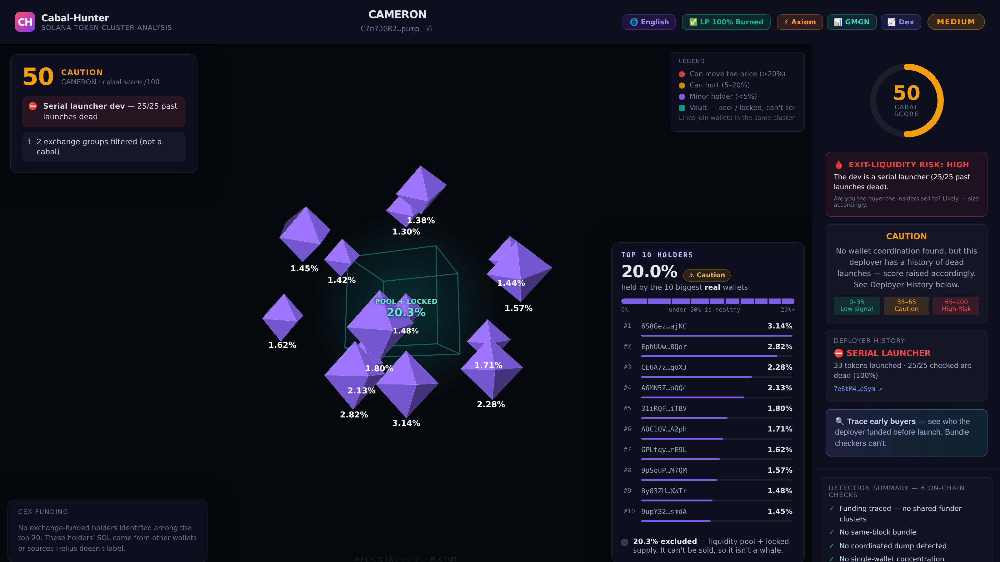

# elizaos-plugin-cabal-hunter

**Solana rug & cabal detection for ElizaOS trading agents.** `CHECK_CABAL_RISK` scans any Solana mint *before your agent buys*: funding-trace cabal detection, same-block Jito bundles, live coordinated dumps, serial-launcher deployer history ("launched 14, 13 dead"), a Solana-native honeypot check (freeze authority + Token-2022 traps) and an exit-liquidity verdict. **Every flag links to its on-chain evidence transaction.**

[](https://insiders.vscode.dev/redirect/mcp/install?name=cabal-hunter&config=%7B%22type%22%3A%20%22http%22%2C%20%22url%22%3A%20%22https%3A%2F%2Fapi.cabal-hunter.com%2Fmcp%22%7D)
[](https://cursor.com/install-mcp?name=cabal-hunter&config=eyJ1cmwiOiAiaHR0cHM6Ly9hcGkuY2FiYWwtaHVudGVyLmNvbS9tY3AifQ==)
[](https://api.cabal-hunter.com/api/info)

> 🌐 **Available in 9 languages:** [English](https://api.cabal-hunter.com/) · [Español](https://api.cabal-hunter.com/es) · [Português](https://api.cabal-hunter.com/pt) · [Français](https://api.cabal-hunter.com/fr) · [Deutsch](https://api.cabal-hunter.com/de) · [Nederlands](https://api.cabal-hunter.com/nl) · [中文](https://api.cabal-hunter.com/zh) · [日本語](https://api.cabal-hunter.com/ja) · [한국어](https://api.cabal-hunter.com/ko)

Powered by [Cabal-Hunter](https://api.cabal-hunter.com) — 250 free scans/month per IP, **no signup, no API key**. Then **$9/month for Unlimited** (fair use), or pay-as-you-go at $0.001 USDC per scan — priced at cost. Prepaid via `POST /api/buy-key` + `X-API-Key` header, or per-call via x402. [Full pricing →](https://api.cabal-hunter.com/pricing)

## ElizaOS quick start




```bash
npm install elizaos-plugin-cabal-hunter
```

```ts
import { cabalHunterPlugin } from "elizaos-plugin-cabal-hunter";

// character / runtime config
export const character = {
  name: "TraderAgent",
  plugins: [cabalHunterPlugin],
  // ...
};
```

Your agent now answers *"is `<mint>` safe?"* with a full forensic verdict — and your strategy code can gate buys directly:

```ts
import { checkCabalRisk, isRisky } from "elizaos-plugin-cabal-hunter";

if (await isRisky(mint)) return; // AVOID / cabal score >= 65 / honeypot — skip the buy

const report = await checkCabalRisk(mint);
console.log(report.recommendation, report.cabal_score, report.top_reasons);
```

## What a scan returns

```jsonc
{
  "recommendation": "AVOID",        // SAFE | REVIEW | AVOID
  "cabal_score": 100,               // 0-100
  "honeypot_risk": "LOW",           // freeze authority + Token-2022 traps
  "exit_liquidity_risk": true,      // can the pool absorb your exit?
  "deployer": { "verdict": "SERIAL_LAUNCHER", "tokens_launched": 14, "dead": 13 },
  "clusters": [{ "wallets": 5, "combined_pct": 23.1, "evidence_tx": "https://solscan.io/tx/…" }],
  "scan_complete": true,            // how much did we even look at —
  "wallets_checked": 15             // apply YOUR risk tolerance, not ours
}
```

`scan_complete` / `wallets_checked` exist so your bot can apply its own risk tolerance instead of inheriting ours — the score is a starting point you can verify (every cluster carries `evidence_txs[]`), not a verdict you take on faith.

## Not using ElizaOS?

- **MCP (Claude Code / Claude Desktop / Cursor / VS Code):** `{"mcpServers": {"cabal-hunter": {"url": "https://api.cabal-hunter.com/mcp"}}}` — or the one-click buttons above.
- **REST:** `curl "https://api.cabal-hunter.com/api/scan-cabal?mintAddress=<MINT>"` — [OpenAPI spec](https://api.cabal-hunter.com/openapi.json)
- **Human?** Free interactive 3D holder map: [api.cabal-hunter.com/map](https://api.cabal-hunter.com/map) — holders as crystals sized by supply share, clusters joined by beams, plus wallet addresses, Solscan receipts, live chart + trade links (Axiom · GMGN · DexScreener) on one screen.

## Cabal-Hunter everywhere

Same detection engine, wherever your stack lives:

- **`npx cabal-hunter-mcp`** — standalone MCP server for Claude · Cursor · VS Code · any MCP client: [cabal-hunter-mcp](https://github.com/paulf280-ui/cabal-hunter-mcp) · [npm](https://www.npmjs.com/package/cabal-hunter-mcp)
- **MCP template / starter:** [solana-safe-sniper-mcp-template](https://github.com/paulf280-ui/solana-safe-sniper-mcp-template)
- **REST API + OpenAPI · free 3D holder map:** [api.cabal-hunter.com](https://api.cabal-hunter.com) · [/map](https://api.cabal-hunter.com/map)

## License

MIT. The plugin is a thin open client; the detection engine runs at [api.cabal-hunter.com](https://api.cabal-hunter.com).
